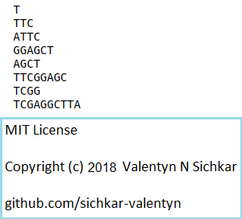

# Slicing in Python
Examples how to use slicing with strings in Python

### Reference to:
[1] Valentyn N Sichkar. Slicing in Python // GitHub platform [Electronic resource]. URL: https://github.com/sichkar-valentyn/Slicing_in_Python (date of access: XX.XX.XXXX)

## Description
Program shows ways how to slice string in Python.

## Multiplication Table

## MIT License
## Copyright (c) 2018 Valentyn N Sichkar
## github.com/sichkar-valentyn
### Reference to:
[1] Valentyn N Sichkar. Slicing in Python // GitHub platform [Electronic resource]. URL: https://github.com/sichkar-valentyn/Slicing_in_Python (date of access: XX.XX.XXXX)
